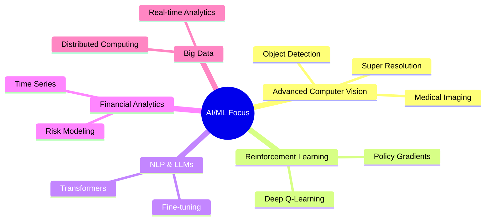

# Hi there! 👋 I'm Randika Prabashwara

<div align="center">

[](https://git.io/typing-svg)

</div>

**Data Science Engineer | Machine Learning Enthusiast | Computer Vision Specialist**

> *"Energetic, risk-taking, and results-oriented rational thinker, passionate about yielding perfect results for any challenge."*

<div align="center">
    <h2>
        <a href="https://randikapra.github.io">
            
        </a>
        <a href="https://linkedin.com/in/randika-prabashwara">
            
        </a>
        <a href="mailto:randikap.20@cse.mrt.ac.lk">
            
        </a>
      <a href="https://github.com/randikapra">
            
        <a href="tel:+94775747823">
            
        </a>
        </a>
    </h2>
</div>

---

## 🚀 About Me

- 🎓 **B.Sc. Engineering (Honours)** in Data Science & Engineering from University of Moratuwa (CGPA: 3.30/4.0)
- 💼 **Data Science Engineer Intern** at Brown and Company PLC
- 🔬 Currently working on **Structure-Informed Super Resolution Technique** for Scientific Imaging (Final Year Research)
- 🏆 **AMP®-Parkinson's Disease Progression Prediction** - Kaggle Top 83%
- 🥇 **Sri Lankan Mathematical Olympiad** High Distinction (2011-2017)
- 📊 Published research: *"A Data-Driven Spatiotemporal Framework for Retail Analytics"* at ADScAI Summit 2025

## 🛠️ Tech Stack

<details>
<summary><b>🔥 Click to expand my technical arsenal</b></summary>

**Languages:**      

**AI/ML:**    

**Web Dev:**  

**Databases:**   

**Big Data:**  

**Cloud & Tools:**   

</details>

## 🔥 Featured Projects

### 🔬 Structure-Informed Super Resolution for Scientific Imaging
> **Final Year Project | Jun 2024 - Present**

<div align="left">

[](https://github.com/randikapra/super-resolution-project)
[](https://your-paper-link.com)

</div>

Developed state-of-the-art super-resolution framework for microscopy and nanoscience imaging with hierarchical multi-scale learning and adaptive feature fusion.

**🎯 Key Achievements:**
- ✅ **3.5dB PSNR improvement, 20% SSIM increase, 20% LPIPS decrease** over SOTA methods
- ✅ Outperformed EDSR, ESRGAN, SPSR, SwinIR, HMANet on benchmark datasets  
- ✅ Novel encoder-driven feature conditioning and Semantic Structural Loss function
- ✅ Successfully applied to scanning electron microscopy (SEM) imaging

**Tech Stack:** `Python` `TensorFlow` `Keras` `Computer Vision` `Deep Learning`

---

### 📊 Geo-Spatial Intelligence Platform
> **Dec 2024 - Present**

<div align="left">

[](https://github.com/randikapra/geo-spatial-platform)
[](https://your-demo-link.com)

</div>

Comprehensive sales analysis system with GPS tracking and behavioral analysis that generates detailed performance reports and identifies sales trends.

**Tech Stack:** `Python` `MySQL` `Flask` `MS Fabric` `MS Azure` `OpenStreetMap`

---

### 🔍 OCR Systems Suite
> **Dec 2023 - May 2025**

<div align="left">

[](https://github.com/randikapra/ocr-systems)

</div>

- **Cheque OCR:** Automated cheque processing with ML-enhanced text extraction
- **License OCR:** Driving license validation without segmentation dependencies

**Tech Stack:** `Python` `OpenCV` `TensorFlow` `Keras` `OCR` `Computer Vision`

## 📈 GitHub Analytics

<div align="center">

<table>
<tr>
<td width="50%">


</td>
<td width="50%">


</td>
</tr>
</table>


</div>

## 🏆 Achievements & Certifications

<details>
<summary><b>🎓 Academic & Professional Achievements</b></summary>

### 🏅 Academic Excellence
- 🥇 **Best Result in Physical Science Stream** - Prince of Wales College, Moratuwa
- 🏆 **Sri Lankan Mathematical Olympiad** High Distinction (2011-2017)
- 🎯 **AMP®-Parkinson's Disease Progression Prediction** - Kaggle Top 83%

### 📚 Certifications
- 📊 **AWS Academy Graduate** - Data Engineering, ML for NLP, ML Foundation  
- 🎓 **Machine Learning Specialization** - Stanford University
- 🔬 **Operations Research** - National Taiwan University
- 🧠 **Mathematics for Machine Learning** - DeepLearning.AI
- 🏥 **AI for Medical Diagnosis** - DeepLearning.AI
- 👁️ **Facial Expression Recognition with PyTorch** - Coursera Project Network

</details>

## 🌱 Currently Exploring

<div align="center">



</div>

## 📊 Weekly Development Breakdown

<!--START_SECTION:waka-->
```text
Python       12 hrs 30 mins  ██████████████████░░░   82.5%
JavaScript    2 hrs 15 mins  ███░░░░░░░░░░░░░░░░░░   14.8%
SQL           25 mins        ▒░░░░░░░░░░░░░░░░░░░░    2.7%
```
<!--END_SECTION:waka-->

## 📫 Get In Touch!

<div align="center">

<h3>📞 Ready to collaborate on exciting projects?</h3>

[](https://randikapra.github.io)
[](https://linkedin.com/in/randika-prabashwara)
[](mailto:randikap.20@cse.mrt.ac.lk)
[](tel:+94775747823)

<br>

**💡 Open to opportunities in:** *Data Science • Machine Learning • Computer Vision • AI Research • Software Development*

*"Seeking opportunities to apply technical and analytical skills to address real-world complex problems and provide impactful solutions."*

---


</div>
