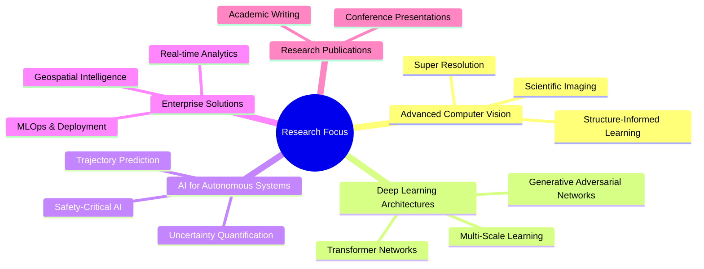

<div align="center">

[](https://git.io/typing-svg)
</div>

<table width="100%" border="0" cellspacing="0" cellpadding="0" style="border: none;">
<tr>
<td width="38%" valign="middle" align="left" style="border: none; padding: 0;">

[](https://git.io/typing-svg)


```bash
randika@portfolio:~$ echo "Ready to innovate! 🚀"█
```
> <sub>*"Transforming complex data into intelligent solutions that drive real-world impact"*</sub>

</td>
<td width="62%" align="center" valign="middle" style="border: none; padding: 0;">


</td>
</tr>
</table>

<div align="center">
    <h2>
        <a href="https://randikapra.github.io">
            
        </a>
        <a href="https://www.linkedin.com/in/randika-prabashwara/">
            
        </a>
        <a href="mailto:randikap.20@cse.mrt.ac.lk">
            
        </a>
      <a href="https://github.com/randikapra">
            
        <a href="tel:+94775747823">
            
        </a>
        </a>
    </h2>
</div>

## 🚀 Quick Overview

```yaml
name: M. A. Randika Prabashwara
role: Data Science Engineer & Research Assistant
education: B.Sc. Engineering (Honours) - Computer Science & Engineering
specialization: Data Science & Engineering
university: University of Moratuwa, Sri Lanka
research_focus: AI-ML Solutions, Computer Vision, Super Resolution
status: Recent Graduate Student & Research Assistant
location: Sri Lanka
experience: 3+ years in ML/AI development
```

### 🎯 What I Do
- 🔬 **Research:** Advanced Computer Vision, Super Resolution & AI-ML Solutions
- 💼 **Work:** Building enterprise-grade data solutions and intelligent platforms
- 🎓 **Study:** Final year at University of Moratuwa (Data Science & Engineering)
- 🏆 **Achieve:** Top 83% Kaggler with proven ML competition track record
- 📚 **Mentor:** Teaching Assistant supporting 100+ students in programming & compiler design

---

## 💡 Featured Projects

### 🔬 CSM-SR: Conditional Structure-Informed Super Resolution GAN
> **🎓 Final Year Research Project | Jun 2024 - Present**

<div align="left">

[](https://github.com/randikapra/CSM-SR-Test3)
[](https://randikapra.github.io/CSM-SR-Test3/)
[](https://our-paper-link.com)


</div>

Revolutionary super-resolution framework for scientific imaging using conditional structure-informed multi-scale learning with advanced encoder-based feature integration and custom Semantic Structural Loss (SSL).

**🎯 Impact & Results:**
- ✅ **3.5dB PSNR improvement, 20% SSIM increase, 20% LPIPS decrease** over state-of-the-art methods
- ✅ **Outperformed EDSR, ESRGAN, SwinIR & HMANet** on SEM dataset & benchmark datasets (Set5, Set14, BSD100)
- ✅ **Novel architecture** with encoder-driven conditioning & three-stage pipeline optimization
- ✅ **Published at ADScAI Summit 2025** - Applied Data Science & Artificial Intelligence

**🛠️ Tech Stack:** `Python` `TensorFlow` `Keras` `PyTorch` `CUDA` `OpenCV` `Computer Vision` `Deep Learning`

---

### 📊 GeoSpatial Intelligence Platform (Enterprise Solution)
> **🏢 Data Science Engineer Intern | Dec 2023 - Jun 2024**

<div align="left">

[](https://github.com/randikapra)
[](https://your-demo-link.com)


</div>

Enterprise-grade sales analytics platform with real-time GPS tracking, behavioral analysis, and automated report generation serving field teams across Sri Lanka.

**🎯 Core Capabilities:**
- 🗺️ **Real-Time GPS Tracking** - Live location monitoring with territory coverage analysis & route optimization
- 🤖 **ML-Powered Intelligence** - Sales forecasting, performance scorecards & opportunity identification  
- 📊 **Comprehensive Dashboards** - Executive analytics with dynamic visualization & automated reporting
- ⚡ **35% Efficiency Improvement** - Reduced operational costs through predictive analytics integration

**🛠️ Tech Stack:** `Python` `FastAPI` `Apache Kafka` `MySQL` `Redis` `React` `Docker` `AWS` `Machine Learning`

---

### 🆔 Advanced OCR System for Sri Lankan Driving Licenses
> **🤖 Computer Vision Solution | Apr 2025 - May 2025**

<div align="left">

[](https://github.com/randikapra/driving-license-ocr)
[](https://your-demo-link.com)


</div>

Revolutionary multi-modal OCR pipeline combining TrOCR, EasyOCR, and Enhanced Tesseract with intelligent multi-factor orientation detection for Sri Lankan driving license processing.

**🎯 Key Achievements:**
- ✅ **96% accuracy in vehicle class extraction, 92% accuracy in data extraction**
- ✅ **1.8 seconds average processing time** with 98% orientation detection success
- ✅ **Adaptive image enhancement** - No segmentation dependencies, handles complex layouts
- ✅ **Production-ready pipeline** - Deployed with comprehensive error handling

**🛠️ Tech Stack:** `TrOCR` `EasyOCR` `PyTorch` `OpenCV` `Transformers` `CUDA` `Computer Vision`

---

<details>
<summary><b>💡 Click to expand more Featured Projects</b></summary>

### 🎵 Distributed Music Genre Classification Engine
> **🎼 Big Data ML Pipeline | Mar 2025 - Jun 2025**

[](https://github.com/randikapra/music-genre-classifier) [](https://your-demo-link.com) 

Scalable machine learning pipeline built on Apache Spark for distributed music genre classification with ensemble approach combining Random Forest, Gradient Boosting Trees, and Logistic Regression.

**🎯 Core Capabilities:**
- 🔥 **Distributed Training** - Implemented scalable feature extraction and distributed clusters
- ⚡ **Ensemble Learning** - Multi-algorithm approach with automated model selection
- 📊 **Production Pipeline** - Complete MLOps workflow with model persistence & deployment
- 🎯 **High Performance** - Optimized for large-scale audio processing workloads

**🛠️ Tech Stack:** `Python` `Apache Spark` `PySpark MLlib` `Audio Processing` `Distributed Computing`

---

### 🚗 SafePathAI: Uncertainty-Aware Trajectory Prediction
> **🤖 Autonomous Driving Research | Jan 2025 - Jun 2025**

[](https://github.com/randikapra/safepath-ai) 

Hybrid framework combining transformer-based neural networks with Bayesian filtering for uncertainty quantification and safety mechanisms in autonomous driving scenarios.

**🎯 Innovation Focus:**
- 🧠 **Hybrid Architecture** - Neural networks with physics-informed constraints
- 🎯 **Uncertainty Quantification** - Bayesian filtering for safety-critical predictions
- 🚗 **Real-World Application** - Designed for autonomous driving trajectory planning
- 📊 **Performance Metrics** - Enhanced prediction accuracy with safety guarantees

**🛠️ Tech Stack:** `PyTorch` `TensorFlow` `Transformers` `FMLC` `FilterPy` `CARLA`

---

### 💰 Automated Cheque OCR System
> **🏦 Financial Document Processing | Previous Project**

[](https://github.com/randikapra/cheque-ocr) 

Intelligent cheque processing system with collaborative 3+ member development team eliminating manual data entry bottlenecks and integrating with Google Cloud Vision API and Azure Computer Vision API.

**🎯 Key Features:**
- 💡 **Automated Processing** - End-to-end cheque data extraction pipeline
- 🔗 **Multi-API Integration** - Google Cloud Vision & Azure Computer Vision
- 👥 **Team Collaboration** - 3+ member development with custom vision models
- 📱 **Mobile Integration** - Seamless mobile application integration

**🛠️ Tech Stack:** `Python` `Google Cloud Vision API` `Azure Computer Vision API` `OpenCV` `Mobile Integration`

</details>

---

## 🛠️ Tech Arsenal

<details>
<summary><b>🔥 Click to expand my technical arsenal</b></summary>

**Programming Languages:**      

**AI/ML & Data Science:**     

**Web Development:**   

**Databases:**     

**Big Data & Streaming:**   

**Cloud & DevOps:**    

**Tools & Others:**    

</details>

---

## 📈 GitHub Analytics

<div align="center">

### 📊 GitHub Statistics
<table>
<tr>
<td width="50%">

**Alternative 1: Try different instance**


**Alternative 2: Force refresh**


</td>
<td width="50%">

**Languages (Alternative Instance)**


**Languages (Force Refresh)**


</td>
</tr>
</table>

### 📈 Contribution Activity


### 🔥 GitHub Streak


</div>

### 🔄 Backup Option: Custom Stats Display
If the APIs continue showing wrong data, here's a manual alternative:

```markdown
### 📊 My GitHub Stats (Manual - Accurate!)
- 🔥 **4,878 contributions** in the last year
- 💻 **Primary Language:** Jupyter Notebook (90.41%)
- 📝 **Active Repositories:** 3+ with recent commits
- 🎯 **Focus Areas:** AI/ML Research Projects
```

### 🏆 Alternative Stats Services
You can also try these other services:
- **GitHub Profile Summary Cards**: `github-profile-summary-cards.vercel.app`
- **GitHub Stats Card**: `awesome-github-stats.azurewebsites.net`

---

### 🏆 GitHub Trophies
<div align="center">

</div>

---
---
---

## 🏆 Achievements & Recognition

<details>
<summary><b>🎓 Academic & Professional Achievements</b></summary>

### 🎯 **Competition Success**
[](https://kaggle.com/randikapra)

**AMP®-Parkinson's Disease Progression Prediction** - Achieved top 83% ranking among global participants

### 🏅 **Academic Excellence**
- 🥇 **Best Result in Physical Science Stream** - Prince of Wales College, Moratuwa
- 🏆 **Mathematical Olympiad High Distinction** (2011-2017) - Consistent high performance
- 🎓 **B.Sc. Engineering (Honours)** - University of Moratuwa (Final Year)
- 📝 **Published Research** - ADScAI Summit 2025 (Applied Data Science & Artificial Intelligence)
- 🏅 **Island Rank 29** - G.C.E Advanced Level (Combined Mathematics, Physics, Chemistry)

### 📚 **Professional Certifications**
- ☁️ **AWS Academy Graduate** - Data Engineering, Machine Learning, NLP
- 🎓 **Machine Learning Specialization** - Stanford University (Coursera)
- 🔬 **Operations Research** - National Taiwan University
- 🧠 **Mathematics for Machine Learning & Data Science** - DeepLearning.AI
- 🏥 **AI for Medical Diagnosis** - DeepLearning.AI

### 💼 **Professional Experience**
- 🔬 **Research Assistant** - University of Moratuwa (Jul 2025 - Present)
- 👨‍🏫 **Teaching Assistant** - University of Moratuwa (Jan 2025 - Jun 2025)
- 💼 **Data Science Engineer Intern** - Pinnacle Company Ltd (Dec 2023 - Jun 2024)

</details>

---

## 🌱 Currently Exploring

<div align="center">



</div>

---

## 📊 Weekly Development Breakdown

<!--START_SECTION:waka-->
```text
Python       15 hrs 45 mins  ████████████████████░   85.2%
JavaScript    1 hr 30 mins   ██░░░░░░░░░░░░░░░░░░░    8.1%
SQL           45 mins        █░░░░░░░░░░░░░░░░░░░░    4.1%
CUDA          25 mins        ▒░░░░░░░░░░░░░░░░░░░░    2.3%
Others        5 mins         ░░░░░░░░░░░░░░░░░░░░░    0.3%
```
<!--END_SECTION:waka-->

---

## 🤝 Let's Collaborate!

**🚀 Open to exciting opportunities in:**     

*"Seeking opportunities to apply advanced technical and analytical skills to address complex real-world problems and deliver impactful AI-driven solutions for industry transformation."*

<div align="center">
    <h2>
        <a href="https://randikapra.github.io">
            
        </a>
        <a href="https://www.linkedin.com/in/randika-prabashwara-739bba237/">
            
        </a>
        <a href="mailto:randikap.20@cse.mrt.ac.lk">
            
        </a>
        <a href="tel:+94775747823">
            
        </a>
    </h2>
</div>

<br>

<div align="center">
  
</div>
