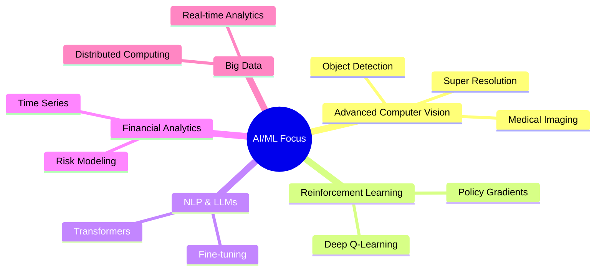

# Hi there! 👋 I'm Randika Prabashwara

<div align="center">

[](https://git.io/typing-svg)

</div>

**Data Science Engineer | Machine Learning Enthusiast | Computer Vision Specialist**

> *"Transforming complex data into intelligent solutions that drive real-world impact"*

<div align="center">
    <h2>
        <a href="https://randikapra.github.io">
            
        </a>
        <a href="https://www.linkedin.com/in/randika-prabashwara-739bba237/">
            
        </a>
        <a href="mailto:randikap.20@cse.mrt.ac.lk">
            
        </a>
      <a href="https://github.com/randikapra">
            
        <a href="tel:+94775747823">
            
        </a>
        </a>
    </h2>
</div>

---

## 🚀 Quick Overview

```yaml
name: Randika Prabashwara
role: Data Science Engineer
education: B.Sc. Engineering (Honours) - Computer Science & Engineering
specialization: Data Science & Engineering
university: University of Moratuwa, Sri Lanka
research_focus (FYP): Structure-Informed Super Resolution Technique for Scientific Imaging
status: Final Year Student
location: Sri Lanka
```

### 🎯 What I Do
- 🔬 **Research:** Advanced Computer Vision & Super Resolution Techniques
- 💼 **Work:** Building scalable data solutions for enterprise clients
- 🎓 **Study:** Final year at University of Moratuwa (Data Science & Engineering)
- 🏆 **Compete:** Active Kaggler with proven track record

---

## 💡 Featured Projects

### 🔬 Structure-Informed Super Resolution for Scientific Imaging
> **🎓 Final Year Research Project | Jun 2024 - Present**

<div align="left">

[](https://github.com/randikapra/CSM-SR-Test3)
[](https://randikapra.github.io/CSM-SR-Test3/)
[](https://our-paper-link.com)


</div>

Pioneering super-resolution framework for microscopy and nanoscience imaging using hierarchical multi-scale learning and adaptive feature fusion.

**🎯 Impact & Results:**
- ✅ **3.5dB PSNR improvement** over state-of-the-art methods
- ✅ **20% SSIM increase, 20% LPIPS decrease** on SEM dataset & benchmark datasets
- ✅ **Outperformed state-of-the-art models EDSR, ESRGAN, SwinIR & HMANet** on scientific imaging tasks
- ✅ **Novel architecture** with encoder-driven conditioning & semantic structural loss

**🛠️ Tech Stack:** `Python` `TensorFlow` `Keras` `Computer Vision` `Deep Learning`

---

### 📊 Geo-Spatial Intelligence Platform
> **🏢 Enterprise Solution | Dec 2024 - Present**

<div align="left">

[](https://github.com/randikapra/Dealer_Dynamics)
[](https://your-demo-link.com)


</div>

Enterprise-grade sales analytics platform with GPS tracking, behavioral analysis, and automated report generation.

**🎯 Core Capabilities:**
- 🗺️ **Geo-Spatial Analytics** - Real-time GPS tracking with route optimization & territory mapping
- 🤖 **ML-Powered Intelligence** - Sales forecasting, customer segmentation & churn prediction  
- 📊 **Advanced Dashboards** - Executive, sales, and performance analytics with interactive visualizations
- ⚡ **Real-Time Processing** - Kafka streams for live GPS data & instant alerts

**🛠️ Tech Stack:** `Python` `FastAPI` `React` `PostgreSQL` `Redis` `Kafka` `TensorFlow` `Docker` `Kubernetes` `Terraform`

---

<details>
<summary><b>💡 Click to expand more Featured Projects</b></summary>
### 🎵 Distributed Music Genre Classification Engine
> **🎼 Big Data ML Pipeline | Nov 2024**

[](https://github.com/randikapra/music-genre-classifier) [](https://github.com/randikapra/music-genre-classifier/tree/main/models) 

High-performance music genre classification system built on Apache Spark for large-scale audio processing and distributed machine learning.

**🎯 Core Capabilities:**
- 🔥 **Spark-Native Pipeline** - Distributed training with Random Forest, GBT & Logistic Regression models
- ⚡ **Scalable Architecture** - Handles massive datasets with automated model persistence & deployment
- 📊 **Multi-Model Ensemble** - Comparative analysis across multiple ML algorithms with performance optimization
- 🔄 **Production Pipeline** - Complete MLOps workflow with model versioning & automated inference

**🛠️ Tech Stack:** `Python` `Apache Spark` `PySpark MLlib` `Audio Processing` `Distributed Computing`
---

### 👁️ OCR Systems Suite
> **🤖 AI-Powered Document Processing | Dec 2023 - May 2025**

<div align="left">

[](https://github.com/randikapra/cheque-ocr)
[](https://github.com/randikapra/driving-license-ocr)


</div>

Comprehensive OCR solution suite for financial and identification document processing.

**🎯 Solutions:**
- 💰 **Cheque OCR:** Automated bank cheque processing with 95%+ accuracy
- 🆔 **License OCR:** Driving license validation without segmentation dependencies
- 🔍 **Smart Preprocessing:** ML-enhanced image optimization pipeline

**🛠️ Tech Stack:** `Python` `OpenCV` `TensorFlow` `Keras` `OCR` `Computer Vision`

---
</details>

## 🛠️ Tech Arsenal

<details>
<summary><b>🔥 Click to expand my technical arsenal</b></summary>

**Programming Languages:**      

**AI/ML & Data Science:**    

**Web Development:**  

**Databases:**   

**Big Data:**  

**Cloud & Tools:**    

</details>

## 📈 GitHub Analytics

<div align="center">

<table>
<tr>
<td width="50%">


</td>
<td width="50%">


</td>
</tr>
</table>


</div>

## 🏆 Achievements & Recognition

<details>
<summary><b>🎓 Academic & Professional Achievements</b></summary>

### 🎯 **Competition Success**
[](https://kaggle.com/randikapra)

**AMP®-Parkinson's Disease Progression Prediction** - Achieved top 83% ranking

### 🏅 **Academic Excellence**
- 🥇 **Best Result in Physical Science** - Prince of Wales College, Moratuwa
- 🏆 **Mathematical Olympiad High Distinction** (2011-2017)
- 🎓 **B.Sc. Engineering (Honours)** - University of Moratuwa
- 📝 **Published Research** - ADScAI Summit 2025

### 📚 **Professional Certifications**
- ☁️ **AWS Academy Graduate** - Data Engineering, ML, NLP
- 🎓 **Machine Learning Specialization** - Stanford University  
- 🔬 **Operations Research** - National Taiwan University
- 🧠 **Mathematics for ML** - DeepLearning.AI
- 🏥 **AI for Medical Diagnosis** - DeepLearning.AI

</details>

## 🌱 Currently Exploring

<div align="center">



</div>

## 📊 Weekly Development Breakdown

<!--START_SECTION:waka-->
```text
Python       12 hrs 30 mins  ██████████████████░░░   82.5%
JavaScript    2 hrs 15 mins  ███░░░░░░░░░░░░░░░░░░   14.8%
SQL           25 mins        ▒░░░░░░░░░░░░░░░░░░░░    2.7%
```
<!--END_SECTION:waka-->

## 🤝 Let's Collaborate!

**🚀 Open to exciting opportunities in:**     

*"Seeking opportunities to apply technical and analytical skills to address real-world complex problems and provide impactful solutions."*

<div align="center">
    <h2>
        <a href="https://randikapra.github.io">
            
        </a>
        <a href="https://www.linkedin.com/in/randika-prabashwara-739bba237/">
            
        </a>
        <a href="mailto:randikap.20@cse.mrt.ac.lk">
            
        </a>
        <a href="tel:+94775747823">
            
        </a>
    </h2>
</div>
<br>
<div align="center">
  

</div>
