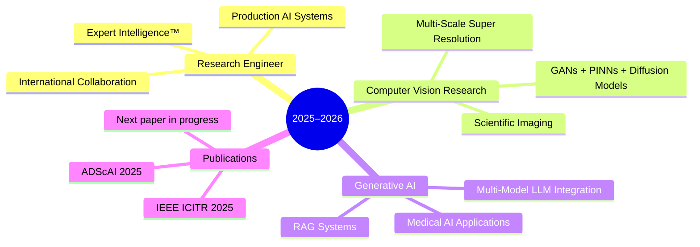

<!-- ═══════════════════════════════════════════════════════════
     RANDIKA PRABASHWARA — GitHub Profile README
     ═══════════════════════════════════════════════════════════ -->

<div align="center">

[](https://git.io/typing-svg)

<br>

<a href="https://randikapra.github.io">
  
</a>
&nbsp;
<a href="https://www.linkedin.com/in/randika-prabashwara/">
  
</a>
&nbsp;
<a href="mailto:randikaprabashwara@gmail.com">
  
</a>
&nbsp;
<a href="https://randikapra.github.io/assets/randika_CV_CSE_EI.pdf">
  
</a>

<br><br>


</div>

---

## 🧬 About Me

```yaml
name:          Randika Prabashwara
current_role:  Research Engineer @ Expert Intelligence™  (Nov 2025 – Present)
prev_role:     Research Assistant @ University of Moratuwa (Jul 2025 – Feb 2026)
education:     B.Sc. Engineering (Honours) — Computer Science & Engineering
               University of Moratuwa, Sri Lanka  |  Specialization: Data Science & Engineering
focus:         Computer Vision · Generative AI · MLOps · Production ML Systems
publications:  2  (IEEE ICITR 2025  +  ADScAI 2025)
location:      Sri Lanka / Remote
status:        Open to research collaborations & exciting ML opportunities
```

### What I'm working on

- 🔬 **Research** — Multi-scale super-resolution with GANs, PINNs & diffusion-based probabilistic models
- 🏭 **Industry** — Production AI systems at Expert Intelligence™ (international, remote)
- 📝 **Publishing** — GSM-SR paper in IEEE ICITR 2025; DSFRA paper at ADScAI 2025
- 🧠 **Exploring** — Multi-modal learning, RAG systems, financial AI

---

## 📰 Publications

<table>
<tr>
<td width="50%" valign="top">

**📄 IEEE ICITR 2025**

**GSM-SR: Generalized Structure-Informed Multi-Scale GAN for Efficient Image Super-Resolution**

*Gayani Wickramarathna, Oshadi Perera, **Randika Prabashwara**, Uthayasanker Thayasivam*

2025 10th International Conference on Information Technology Research · Paper ID: ICITR2025-145


</td>
<td width="50%" valign="top">

**📄 ADScAI 2025**

**A Data-Driven Spatiotemporal Framework for Retail Analytics**

***Randika Prabashwara**, H.K. Gayani V.L. Wickramarathna, Uthayasanker Thayasivam*

Applied Data Science & Artificial Intelligence Symposium 2025 · University of Moratuwa Library

[](https://dl.lib.uom.lk/handle/123/24385)
[](https://github.com/randikapra/Dealer_Dynamics)


**Key results:** 86.5% prediction accuracy · 20.3% delivery cost reduction

</td>
</tr>
</table>

---

## 🚀 Featured Projects

### 🔬 CSM-SR — Conditional Structure-Informed Multi-Scale Super-Resolution GAN
> *Final Year Research Project · Jun 2024 – Oct 2025 · Team of 3 · Principal Researcher*

[](https://github.com/randikapra/CSM-SR-Test3)
[](https://randikapra.github.io/CSM-SR-Test3/)


Pioneering super-resolution framework for microscopy and nanoscience imaging. Novel architecture integrating encoder-based feature conditioning, multi-scale discriminator design, and a custom **Semantic Structural Loss (SSL)** function.

| Metric | Result | Baseline Improvement |
|--------|--------|---------------------|
| PSNR (Set5/Set14/BSD100) | State-of-the-art | **+3.5 dB** |
| SSIM | 0.978 (SEM dataset) | **+20%** |
| LPIPS | 0.178 (SEM dataset) | **−20%** |
| Outperforms | EDSR, ESRGAN, SwinIR, HMANet | ✅ All benchmarks |

`Python` `PyTorch` `TensorFlow` `Keras` `CUDA` `OpenCV` `Custom GAN`

---

### 📊 GeoSales Intelligence Platform — Enterprise ML System
> *Brown & Company PLC · Dec 2024 – Oct 2025 · Lead Data Scientist*

[](https://github.com/randikapra)


Enterprise-grade sales analytics platform translating a vague requirement ("better field visibility") into a concrete ML system: GPS-based route reconstruction, geospatial territory clustering (DBSCAN/OPTICS), and predictive opportunity scoring.

| Impact | Value |
|--------|-------|
| Sales Efficiency | **+35%** |
| Operational Cost Reduction | **−40%** |
| API Latency | **< 500ms** |
| Prediction Accuracy | **88%** in production |

`Python` `FastAPI` `Apache Kafka` `PostgreSQL` `Redis` `Docker` `Azure` `React`

---

### 🧠 MedAssist AI — Multi-Model RAG Medical Conversational System
> *Independent Research · Aug 2025 – Present · Lead Developer*

[](https://github.com/randikapra)


RAG-powered medical chatbot with multi-model LLM consensus routing (Llama, OpenAI, Gemini, Claude), Pinecone vector database for semantic search, and persistent conversation memory.

- **80% query classification accuracy** across 4 integrated LLM providers
- Semantic search over medical knowledge base with source attribution per response
- Intelligent routing: model selected per query type (diagnostic / informational / drug interaction)

`LangChain` `FastAPI` `PyTorch` `Pinecone` `OpenAI API` `Docker` `CUDA`

<details>
<summary><b>📂 View all 9 projects</b></summary>

<br>

### 🆔 Advanced Sri Lankan Driving License OCR System
> *Apr 2025 – May 2025 · Independent*

[](https://github.com/randikapra)


Multi-model OCR pipeline combining TrOCR, EasyOCR, and Enhanced Tesseract with 4-factor orientation detection, overcoming the 60–70% accuracy ceiling of existing solutions.

**Results:** 96% vehicle class accuracy · 92% date extraction · 98% orientation detection · 1.8s avg processing

`TrOCR` `EasyOCR` `PyTorch` `OpenCV` `Transformers` `CUDA`

---

### 💰 Cheque OCR System — Banking Automation
> *Brown & Company PLC · Dec 2023 – Jun 2024 · Team of 3*

3-layer OCR pipeline using Google Cloud Vision API, Azure Computer Vision API, and custom vision models for Sri Lankan bank cheque processing. Eliminated manual data entry bottlenecks with mobile banking integration.

`Google Cloud Vision` `Azure CV` `Python` `OpenCV` `FastAPI`

---

### 📋 Automated Report Generation Pipeline
> *Brown & Company PLC · Dec 2023 – Jun 2024 · Independent*

Fully automated data pipeline replacing manual Excel-based weekly reporting. Scheduled extraction from PostgreSQL, automated EDA with anomaly flagging, dynamic visualization, and templated report assembly delivered to stakeholders automatically.

`Python` `pandas` `Matplotlib` `Plotly` `PostgreSQL` `Jinja2` `Azure`

---

### 🎓 RPAL Automated Assessment System
> *University of Moratuwa · Jan 2025 – Jun 2025 · Teaching Assistant*

Automated evaluation engine for RPAL programming assignments. Compiles, executes, and scores 100+ student submissions against comprehensive test suites with structured per-student feedback generation.

**Impact:** 70% reduction in grading time · 100% consistent scoring

`Python` `Compiler Design` `Automated Testing` `AST Analysis`

---

### 🎵 Distributed Music Genre Classification Engine
> *Mar 2025 – Jun 2025 · Big Data Project*

[](https://github.com/randikapra/music-genre-classifier)

Fully Spark-native distributed ML pipeline for music genre classification. Ensemble of Random Forest, Gradient Boosting Trees, and Logistic Regression with parallel feature extraction across distributed clusters.

`Apache Spark` `PySpark MLlib` `MLflow` `Python` `Distributed Computing`

</details>

---

## 🛠️ Technical Arsenal

<div align="center">

**Core Languages**


**ML & Deep Learning**


**MLOps & Infrastructure**


**Cloud Platforms**


**Data & Databases**


</div>

---

## 📈 GitHub Analytics

<div align="center">

<table>
<tr>
<td width="50%">

</td>
<td width="50%">

</td>
</tr>
</table>


</div>

---

## 🏆 Trophies

<div align="center">

</div>

---

## 🎖️ Achievements & Credentials

<table>
<tr>
<td width="50%" valign="top">

**🏅 Academic**
- 🥇 Island Rank **29** — G.C.E. A/L Physical Science Stream (Z: 2.1848)
- 🏆 Sri Lankan Mathematical Olympiad — **High Distinction** (2011–2017)
- 🎓 Best Result in Physical Science Stream — Prince of Wales College
- 📊 Kaggle — **Top 83%** · AMP® Parkinson's Disease Prediction

</td>
<td width="50%" valign="top">

**📜 Certifications**
- ☁️ **AWS** — Data Engineering · ML for NLP · ML Foundations
- 🟢 **NVIDIA DLI** — Fundamentals of Deep Learning
- 🎓 **Stanford** (Coursera) — Machine Learning Specialization
- 🧮 **DeepLearning.AI** — Mathematics for ML & Data Science

</td>
</tr>
</table>

---

## 🌐 Current Focus


```mermaid
mindmap
  root((2025–2026))
    Research Engineer
      Expert Intelligence™
      Production AI Systems
      International Collaboration
    Computer Vision Research
      Multi-Scale Super Resolution
      GANs + PINNs + Diffusion Models
      Scientific Imaging
    Generative AI
      RAG Systems
      Multi-Model LLM Integration
      Medical AI Applications
    Publications
      IEEE ICITR 2025
      ADScAI 2025
      Next paper in progress
```

---

<div align="center">

*"Transforming complex data into intelligent solutions that drive real-world impact."*

<br>

[](https://randikapra.github.io)
&nbsp;
[](https://www.linkedin.com/in/randika-prabashwara/)
&nbsp;
[](mailto:randikaprabashwara@gmail.com)

</div>
